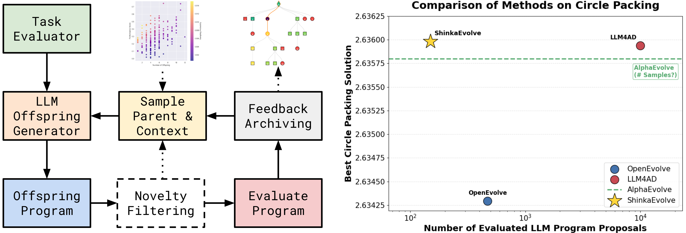

<h1 align="center">
  <a href="docs/genesis-logo.png?raw=true">
    
  </a><br>
  <b><code>Genesis</code>: Towards Open-Ended and Sample-Efficient Program Evolution 🧬</b><br>
</h1>

<p align="center">
  
  <a href="https://github.com/astral-sh/ruff"></a>
  <a href="http://arxiv.org/abs/2509.19349"></a>
  <a href="https://genesis.ai"></a>
</p>

[`Genesis`](https://genesis.ai) is a framework that combines Large Language Models (LLMs) with evolutionary algorithms to drive scientific discovery. By leveraging the creative capabilities of LLMs and the optimization power of evolutionary search, `Genesis` enables automated exploration and improvement of scientific code. 


> **Note**: This implementation is based on and extends [Shinka AI](https://github.com/shinkadotai/shinka), an open-source platform for LLM-driven code evolution. We are grateful to the original authors for their foundational work.

The system is inspired by the [AI Scientist](https://sakana.ai/ai-scientist/), [AlphaEvolve](https://deepmind.google/discover/blog/alphaevolve-a-gemini-powered-coding-agent-for-designing-advanced-algorithms/), and [Darwin Goedel Machine](https://sakana.ai/dgm/). It also draws on recent long-horizon memory work such as [ALMA](https://arxiv.org/abs/2505.20290) for persistent agent memory design. It maintains a population of programs that evolve over generations, with an ensemble of LLMs acting as intelligent mutation operators that suggest code improvements.

The framework supports **parallel evaluation of candidates** locally or in cloud sandboxes (E2B). It maintains an archive of successful solutions, enabling knowledge transfer between different evolutionary islands. `Genesis` is particularly well-suited for scientific tasks where there is a verifier available and the goal is to optimize performance metrics while maintaining code correctness and readability.



## Documentation 📝

| Guide | Description | What You'll Learn |
|-------|-------------|-------------------|
| 🚀 **[Getting Started](docs/getting_started.md)** | Installation, basic usage, and examples | Setup, first evolution run, core concepts |
| 📓 **[Tutorial Notebook](examples/genesis_tutorial.ipynb)** | Interactive walkthrough of Genesis features | Hands-on examples, configuration, best practices |
| 🛠️ **[Creating Tasks](docs/creating_tasks.md)** | Guide to creating custom tasks | File structure, evaluation scripts, configuration |
| ☁️ **[E2B Integration](docs/e2b_integration.md)** | Running evaluations in cloud sandboxes | Setup, configuration, dependencies |
| ⚙️ **[Configuration](docs/configuration.md)** | Comprehensive configuration reference | All config options, optimization settings, advanced features |
| 🎨 **[WebUI](docs/webui.md)** | Interactive visualization and monitoring | Real-time tracking, result analysis, debugging tools |
| 🌐 **[Live Demo](https://genesis-frontend-a7eq2wihnq-nw.a.run.app/)** | Hosted Genesis frontend | Try Genesis in the browser |
| 🗺️ **[Roadmap](ROADMAP.md)** | Future plans and language support | Supported languages, execution backends, planned features |

## Installation & Quick Start 🚀

```bash
# Clone the repository
git clone https://github.com/GeorgePearse/Genesis
# Install uv if you haven't already
curl -LsSf https://astral.sh/uv/install.sh | sh

# Create environment and install Genesis
cd Genesis
uv venv --python 3.12
source .venv/bin/activate  # On Windows: .venv\Scripts\activate
uv pip install -e .

# Run your first evolution experiment
genesis_launch variant=circle_packing_example
```

For detailed installation instructions and usage examples, see the [Getting Started Guide](docs/getting_started.md).

## Examples 📖

| Example | Description | Environment Setup |
|---------|-------------|-------------------|
| ⭕ [Circle Packing](examples/circle_packing) | Optimize circle packing to maximize radii. | `LocalJobConfig` |
| 🤖 [Agent Design](examples/adas_aime) | Design agent scaffolds for math tasks. | `LocalJobConfig` |
| 🎯 [ALE-Bench](examples/ale_bench) | Code optimization for ALE-Bench tasks. | `LocalJobConfig` |
| ✨ [Novelty Generator](examples/novelty_generator) | Generate creative, surprising outputs (e.g., ASCII art). | `LocalJobConfig` |

### External Test Case Repo

- [GeorgePearse/squeeze](https://github.com/GeorgePearse/squeeze): Explicit external test-case repository used for Genesis optimization experiments.


## `genesis` Run with Python API 🐍

For the simplest setup with default settings, you only need to specify the evaluation program:

```python
from genesis.core import EvolutionRunner, EvolutionConfig
from genesis.database import DatabaseConfig
from genesis.launch import LocalJobConfig

# Minimal config - only specify what's required
job_config = LocalJobConfig(eval_program_path="evaluate.py")
db_config = DatabaseConfig()
evo_config = EvolutionConfig(init_program_path="initial.py",)

# Run evolution with defaults
runner = EvolutionRunner(
    evo_config=evo_config,
    job_config=job_config,
    db_config=db_config,
)
runner.run()
```

<details>
<summary><strong>EvolutionConfig Parameters</strong> (click to expand)</summary>

| Key | Default Value | Type | Explanation |
|-----|---------------|------|-------------|
| `task_sys_msg` | `None` | `Optional[str]` | System message describing the optimization task |
| `patch_types` | `["diff"]` | `List[str]` | Types of patches to generate: "diff", "full", "cross" |
| `patch_type_probs` | `[1.0]` | `List[float]` | Probabilities for each patch type |
| `num_generations` | `10` | `int` | Number of evolution generations to run |
| `max_parallel_jobs` | `2` | `int` | Maximum number of parallel evaluation jobs |
| `max_patch_resamples` | `3` | `int` | Max times to resample a patch if it fails |
| `max_patch_attempts` | `5` | `int` | Max attempts to generate a valid patch |
| `job_type` | `"local"` | `str` | Job execution type: "local" or "e2b" |
| `language` | `"python"` | `str` | Programming language for evolution |
| `llm_models` | `["azure-gpt-4.1-mini"]` | `List[str]` | List of LLM models for code generation |
| `llm_dynamic_selection` | `None` | `Optional[Union[str, BanditBase]]` | Dynamic model selection strategy |
| `llm_dynamic_selection_kwargs` | `{}` | `dict` | Kwargs for dynamic selection |
| `llm_kwargs` | `{}` | `dict` | Additional kwargs for LLM calls |
| `meta_rec_interval` | `None` | `Optional[int]` | Interval for meta-recommendations |
| `meta_llm_models` | `None` | `Optional[List[str]]` | LLM models for meta-recommendations |
| `meta_llm_kwargs` | `{}` | `dict` | Kwargs for meta-recommendation LLMs |
| `meta_max_recommendations` | `5` | `int` | Max number of meta-recommendations |
| `embedding_model` | `None` | `Optional[str]` | Model for code embeddings |
| `init_program_path` | `"initial.py"` | `Optional[str]` | Path to initial program to evolve |
| `results_dir` | `None` | `Optional[str]` | Directory to save results (auto-generated if None) |
| `max_novelty_attempts` | `3` | `int` | Max attempts for novelty generation |
| `code_embed_sim_threshold` | `1.0` | `float` | Similarity threshold for code embeddings |
| `novelty_llm_models` | `None` | `Optional[List[str]]` | LLM models for novelty judgment |
| `novelty_llm_kwargs` | `{}` | `dict` | Kwargs for novelty LLMs |
| `use_text_feedback` | `False` | `bool` | Whether to use text feedback in evolution |

</details>

<details>
<summary><strong>DatabaseConfig Parameters</strong> (click to expand)</summary>

| Key | Default Value | Type | Explanation |
|-----|---------------|------|-------------|
| `db_path` | `None` | `Optional[str]` | Database file path (auto-generated if None) |
| `num_islands` | `4` | `int` | Number of evolution islands for diversity |
| `archive_size` | `100` | `int` | Size of program archive per island |
| `elite_selection_ratio` | `0.3` | `float` | Proportion of elite programs for inspiration |
| `num_archive_inspirations` | `5` | `int` | Number of archive programs to use as inspiration |
| `num_top_k_inspirations` | `2` | `int` | Number of top-k programs for inspiration |
| `migration_interval` | `10` | `int` | Generations between island migrations |
| `migration_rate` | `0.1` | `float` | Proportion of island population to migrate |
| `island_elitism` | `True` | `bool` | Keep best programs on their original islands |
| `enforce_island_separation` | `True` | `bool` | Enforce full separation between islands |
| `parent_selection_strategy` | `"power_law"` | `str` | Parent selection: "weighted", "power_law", "beam_search" |
| `exploitation_alpha` | `1.0` | `float` | Power-law exponent (0=uniform, 1=power-law) |
| `exploitation_ratio` | `0.2` | `float` | Chance to pick parent from archive |
| `parent_selection_lambda` | `10.0` | `float` | Sharpness of sigmoid for weighted selection |
| `num_beams` | `5` | `int` | Number of beams for beam search selection |

</details>

<details>
<summary><strong>JobConfig Parameters</strong> (click to expand)</summary>

**LocalJobConfig** (for local execution):
| Key | Default Value | Type | Explanation |
|-----|---------------|------|-------------|
| `eval_program_path` | `"evaluate.py"` | `Optional[str]` | Path to evaluation script |
| `extra_cmd_args` | `{}` | `Dict[str, Any]` | Additional command line arguments |
| `time` | `None` | `Optional[str]` | Time limit for job execution |
| `conda_env` | `None` | `Optional[str]` | Conda environment to run jobs in |

**E2BJobConfig** (for E2B cloud sandboxes):
| Key | Default Value | Type | Explanation |
|-----|---------------|------|-------------|
| `eval_program_path` | `"evaluate.py"` | `Optional[str]` | Path to evaluation script |
| `extra_cmd_args` | `{}` | `Dict[str, Any]` | Additional command line arguments |
| `template` | `"base"` | `str` | E2B sandbox template |
| `timeout` | `300` | `int` | Sandbox timeout in seconds |
| `dependencies` | `[]` | `Optional[List[str]]` | Pip packages to install |
| `additional_files` | `{}` | `Optional[Dict[str, str]]` | Files to upload (sandbox_path -> local_path) |
| `env_vars` | `{}` | `Optional[Dict[str, str]]` | Environment variables to set |

</details>

### Evaluation Setup & Initial Solution 🏃

To use EvolutionRunner, you need two key files: The **`evaluate.py`** script defines how to test and score your programs - it runs multiple evaluations, validates results, and aggregates them into metrics that guide the `genesis` evolution loop. The **`initial.py`** file contains your starting solution with the core algorithm that will be iteratively improved by LLMs across generations.

<table>
<tr>
<td width="50%">

**`evaluate.py` - Evaluation Script**

```python
from genesis.core import run_genesis_eval

def main(program_path: str,
         results_dir: str):
    metrics, correct, err = run_genesis_eval(
        program_path=program_path,
        results_dir=results_dir,
        experiment_fn_name="run_experiment",
        num_runs=3, # Multi-evals to aggreg.
        get_experiment_kwargs=get_kwargs,
        aggregate_metrics_fn=aggregate_fn,
        validate_fn=validate_fn,  # Optional
    )

def get_kwargs(run_idx: int) -> dict:
    return {"param1": "value", "param2": 42}

def aggregate_fn(results: list) -> dict:
    score = results[0]
    text = results[1]
    return {
        "combined_score": float(score),
        "public": {...},  # genesis-visible
        "private": {...},  # genesis-invisible
        "extra_data": {...},  # store as pkl
        "text_feedback": text,  # str fb
    }

if __name__ == "__main__":
    # argparse program path & dir
    main(program_path, results_dir)
```

</td>
<td width="50%">

**`initial.py` - Starting Solution**

```python
# EVOLVE-BLOCK-START
def advanced_algo():
    # This will be evolved
    return solution
# EVOLVE-BLOCK-END

def run_experiment(**kwargs):
    """Main called by evaluator"""
    result = solve_problem(kwargs)
    return result

def solve_problem(params):
    solution = advanced_algo()
    return solution
```

**Key Points:**
- Eval name matches `experiment_fn_name`
- Use `EVOLVE-BLOCK-START` and `EVOLVE-BLOCK-END` to mark evolution sections
- Return format matches validation expectations
- Dependencies must be available in env
- Results can be unpacked for metrics
- Auto-stores several results in `results_dir`
- Can add text feedback in `genesis` loop
- Higher `combined_score` values indicate better performance (maximization)

</td>
</tr>
</table>


## `genesis` Launcher with Hydra 🚀

`genesis` Launcher utilizes [Hydra](https://hydra.cc/) to configure and launch evolutionary experiments effortlessly. It supports concise configuration via Hydra's powerful override syntax, making it easy to manage and iterate scientific explorations.

```bash
# Run with pre-configured variant
genesis_launch variant=circle_packing_example

# Run with custom parameters
genesis_launch \
    task=circle_packing \
    database=island_large \
    evolution=small_budget \
    cluster=local \
    evo_config.num_generations=20
```

For comprehensive configuration options and advanced usage, see the [Configuration Guide](docs/configuration.md).


## Interactive WebUI 🎨

Monitor your evolution experiments in real-time with Genesis's interactive web interface! The WebUI provides live visualization of the evolutionary process, genealogy trees, and performance metrics.


*The Programs view showing evolution results from HNSW optimization, with sortable columns for generation, score, cost, and complexity metrics.*

### Quick Start

Launch the WebUI alongside your evolution experiment:

```bash
# Start your evolution experiment
genesis_launch variant=circle_packing_example

# In another terminal, start the frontend
cd genesis/webui/frontend
npm install
npm run dev
```

For detailed WebUI documentation, see the [WebUI Guide](docs/webui.md).

### Hosted Auth and Payments Plan

The current WebUI is primarily structured as a local developer tool. The React frontend talks to a local API, and the existing Node/Express server scans local result databases from disk. That is convenient for local experimentation, but it is not the right public-facing shape for multi-user authentication or billing.

If Genesis is being turned into a hosted product, the simplest implementation path is:

1. Use **Clerk** for user authentication and enable **Google sign-in** through Clerk rather than building OAuth directly.
2. Use **Stripe Checkout** for subscription purchases and the **Stripe Billing Portal** for self-serve subscription management.
3. Keep auth and billing in the existing `genesis/webui/frontend/server/index.ts` Express layer.
4. Keep the Python backend focused on experiment and analytics APIs, ideally behind the authenticated Node layer.
5. Add a small hosted database table to map `clerk_user_id` to `stripe_customer_id`, subscription status, and any internal workspace or organization identifiers.

Recommended hosted architecture:

- **Frontend**: Vite/React app with Clerk React SDK for sign-in state and gated routes.
- **Node server**: Express middleware that verifies Clerk sessions, creates Stripe Checkout sessions, exposes the Stripe Billing Portal, and handles Stripe webhooks.
- **Database**: Postgres, Supabase, or Neon for user, customer, and subscription records.
- **Python API**: Internal data service for experiments, results, and analytics. Do not expose raw filesystem-backed database reads directly to the public internet.

Recommended user flow:

1. A user clicks "Continue with Google".
2. Clerk handles the Google OAuth flow and returns an authenticated session.
3. If the user does not have an active subscription, the app redirects them to Stripe Checkout.
4. Stripe sends subscription events to a webhook on the Node server.
5. The webhook updates the subscription state in the hosted database.
6. Protected API routes allow access only when the user has both a valid Clerk session and an active Stripe subscription.

Why this is the simplest path:

- Clerk removes the need to implement OAuth, session storage, password reset flows, and account recovery.
- Stripe Checkout is much simpler and safer than building custom card collection.
- The existing Express server is already the most natural place to add auth middleware and billing endpoints.
- Keeping billing and identity out of the Python analytics layer reduces coupling and operational risk.

Important implementation note:

The current local WebUI accepts client-supplied database paths and reads result files directly from disk. That is acceptable for local use, but before enabling hosted sign-in and payments, Genesis should move to a proper multi-user server model where the public API is permissioned and data access is scoped to the authenticated user or workspace.

## Related Open-Source Projects 🧑‍🔧

- **[Shinka AI](https://github.com/shinkadotai/shinka)**: The original implementation that Genesis is based on - a platform for LLM-driven program evolution
- **[SkyDiscover](https://github.com/skydiscover-ai/skydiscover)**: Modular AI-driven discovery framework with 200+ benchmarks, adaptive algorithms (AdaEvolve, EvoX), quality-diversity archives, and human-in-the-loop feedback
- [OpenEvolve](https://github.com/codelion/openevolve): An open-source implementation of AlphaEvolve
- [ATLAS](https://github.com/itigges22/ATLAS): A related open-source agentic research and experimentation platform
- [LLM4AD](https://github.com/Optima-CityU/llm4ad): A Platform for Algorithm Design with Large Language Model
- [Scale AgentEx](https://github.com/scaleapi/scale-agentex): Automated experimentation and optimization for AI agents
- [SkyDiscover](https://github.com/BigComputer-Project/SkyThought): Program evolution framework with AdaEvolve/EvoX, quality-diversity archives, and cascade evaluation
- [AutoHarness (OpenReview)](https://openreview.net/forum?id=g9rEYVNn5T): Agent reliability approach that auto-synthesizes code harnesses to prevent illegal environment actions
- [nano-trm](https://github.com/olivkoch/nano-trm): Tiny reasoning models
- [ADAS](https://www.shengranhu.com/ADAS/): Automated Design of Agentic Systems
- [ALMA-memory](https://github.com/RBKunnela/ALMA-memory)
- [py-turboquant](https://github.com/RyanCodrai/py-turboquant): Python implementation of TurboQuant for vector search

### Potentially Relevant Repos from Dicklesworthstone

- [cass_memory_system](https://github.com/Dicklesworthstone/cass_memory_system): Procedural memory infrastructure for coding agents that is relevant to Genesis memory/history and long-horizon optimization context.
- [claude_code_agent_farm](https://github.com/Dicklesworthstone/claude_code_agent_farm): Parallel multi-agent coding orchestration patterns that map to Genesis-style distributed exploration and task parallelism.
- [destructive_command_guard](https://github.com/Dicklesworthstone/destructive_command_guard): Agent safety guardrail for blocking risky shell/git actions, relevant to safer autonomous code-evolution workflows.
- [coding_agent_session_search](https://github.com/Dicklesworthstone/coding_agent_session_search): Cross-session retrieval/indexing ideas that could inform Genesis run introspection and prior-run reuse.
- [fast_cmaes](https://github.com/Dicklesworthstone/fast_cmaes): CMA-ES optimization backend that could inspire non-evolutionary or hybrid optimizer integrations for Genesis.

## CI Acceleration: Faster GitHub Actions Runners

The monorepo's Rust compilation (squeeze + genesis_rust_backend) and testcontainers-based integration tests are the CI bottleneck. Switching from GitHub-hosted runners to faster alternatives would cut build times roughly in half:

| Provider | Summary | Link |
|----------|---------|------|
| **Blacksmith** | Gaming-grade CPUs, 2x faster builds at half the cost. YC-backed, drop-in `runs-on` replacement. | [blacksmith.sh](https://www.blacksmith.sh/) |
| **RunsOn** | Self-hosted on your own AWS account. Cheapest option long-term, full control. | [runs-on.com](https://runs-on.com/) |
| **BuildJet** | Managed high-perf runners, good ARM64 support. | [buildjet.com](https://buildjet.com/) |
| **Namespace** | Remote caching + fast runners, strong Rust/Bazel story. | [namespace.so](https://namespace.so/) |
| **Depot** | Specialises in fast Docker builds; also offers general runners. | [depot.dev](https://depot.dev/) |

**Migration is a one-line change** -- replace `runs-on: ubuntu-latest` with e.g. `runs-on: blacksmith-4vcpu-ubuntu-2404`. No workflow logic changes needed. Evaluate once CI minutes become a cost or velocity concern.

## Acknowledgments 🙏

Genesis is built upon the excellent work of the [Shinka AI](https://github.com/shinkadotai/shinka) project. We extend our gratitude to the original authors and contributors for creating such a robust foundation for LLM-driven code evolution.

## Citation ✍️


If you use `Genesis` in your research, please cite:

```
@misc{genesis2025,
  title={Genesis: Platform Experiments for LLM-Driven Program Evolution},
  author={Pearse, George},
  howpublished={\url{https://genesis.ai}},
  year={2025}
}
```

And please also consider citing the original Shinka AI work that this is based on.
