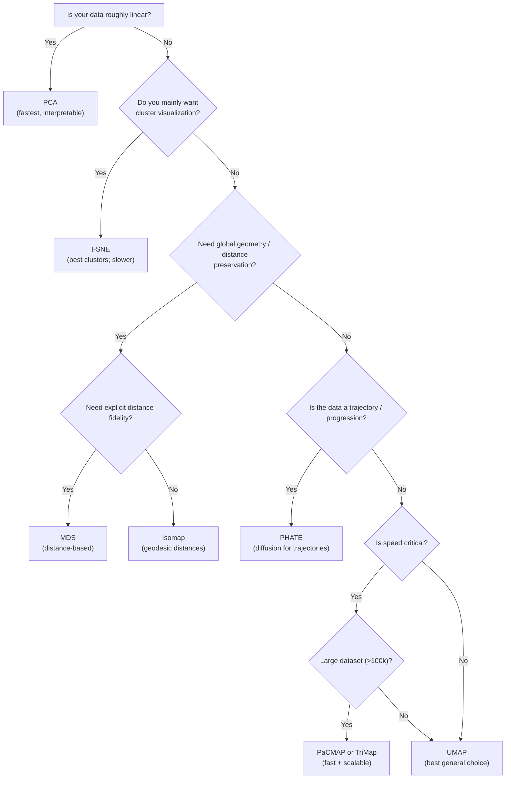

# Dimensionality Reduction Algorithms

Squeeze implements 9 dimensionality reduction algorithms, all with a consistent scikit-learn compatible API. This guide helps you understand each algorithm and choose the right one for your data.

## Quick Comparison

| Algorithm | Type | Preserves | Speed | Scalability | Best For |
|-----------|------|-----------|-------|-------------|----------|
| [PCA](pca.md) | Linear | Global variance | Fastest | Excellent | Pre-processing, linear data |
| [t-SNE](tsne.md) | Nonlinear | Local clusters | Medium* | Good* | Visualization of clusters |
| [UMAP](umap.md) | Topological | Local + Global | Fast | Good | General purpose |
| [MDS](mds.md) | Distance-based | Pairwise distances | Medium | Medium | Distance preservation |
| [Isomap](isomap.md) | Manifold | Geodesic distances | Slow | Poor | Manifold recovery |
| [LLE](lle.md) | Manifold | Local linearity | Medium | Medium | Smooth manifolds |
| [PHATE](phate.md) | Diffusion | Trajectories | Medium | Medium | Biological/trajectory data |
| [TriMap](trimap.md) | Triplet-based | Local + Global | Fast | Good | Large datasets |
| [PaCMAP](pacmap.md) | Pair-based | Local + Global | Fast | Good | Best speed/quality tradeoff |

*t-SNE now supports Barnes-Hut O(n log n) approximation for large datasets and early stopping for faster convergence.

## Choosing an Algorithm

### Decision Flowchart



### By Use Case

| Use Case | Recommended Algorithm | Why |
|----------|----------------------|-----|
| **Quick exploration** | PCA | Fast, interpretable |
| **Cluster visualization** | t-SNE, UMAP | Excellent local structure |
| **Large datasets (>100k)** | PaCMAP, TriMap | Fast, scalable |
| **Biological trajectories** | PHATE | Designed for this |
| **Preserving distances** | MDS | Explicit distance preservation |
| **Curved manifolds** | Isomap, LLE | Geodesic/local structure |
| **General purpose** | UMAP | Best overall balance |

### By Data Size

| Dataset Size | Recommended | Avoid |
|--------------|-------------|-------|
| Small (<1k) | Any algorithm | - |
| Medium (1k-10k) | Any algorithm | - |
| Large (10k-100k) | UMAP, PaCMAP, TriMap, PCA | t-SNE, Isomap |
| Very Large (>100k) | PCA, PaCMAP, TriMap | t-SNE, MDS, Isomap, LLE |

## Benchmark Results

All algorithms benchmarked on the sklearn Digits dataset (1,797 samples, 64 features):

| Algorithm | Time | Trustworthiness@15 |
|-----------|------|-------------------|
| PCA | <0.01s | 0.829 |
| t-SNE | 12.97s | 0.990 |
| UMAP | 6.39s | 0.985 |
| MDS | 5.50s | 0.889 |
| Isomap | 6.07s | 0.658 |
| LLE | 11.46s | 0.512 |
| PHATE | 6.17s | 0.828 |
| TriMap | 0.30s | 0.500 |
| PaCMAP | 0.13s | 0.978 |

**Key insights:**
- **Best quality**: t-SNE (0.990) and UMAP (0.985)
- **Best speed/quality**: PaCMAP (0.13s, 0.978 trustworthiness)
- **Fastest**: PCA (<0.01s)

## Algorithm Categories

### Linear Methods
- **[PCA](pca.md)**: Projects data onto directions of maximum variance

### Neighbor Embedding Methods
- **[t-SNE](tsne.md)**: Minimizes KL divergence between probability distributions
- **[UMAP](../how_umap_works.md)**: Optimizes fuzzy topological representation

### Distance-Based Methods
- **[MDS](mds.md)**: Preserves pairwise distances
- **[Isomap](isomap.md)**: Preserves geodesic (manifold) distances

### Local Structure Methods
- **[LLE](lle.md)**: Preserves local linear relationships

### Diffusion Methods
- **[PHATE](phate.md)**: Uses diffusion to capture data geometry

### Modern Scalable Methods
- **[TriMap](trimap.md)**: Uses triplet constraints
- **[PaCMAP](pacmap.md)**: Uses pair-based optimization with phased learning

## Common API

All algorithms share the same interface:

```python
import squeeze

# Fit and transform
embedding = squeeze.ALGORITHM(n_components=2, **params).fit_transform(X)

# Or fit separately (for some algorithms)
reducer = squeeze.ALGORITHM(n_components=2)
reducer.fit(X)
embedding = reducer.transform(X)
```

## Further Reading

- [UMAP: How It Works](../how_umap_works.md) - Deep dive into UMAP theory
- [Evaluation Metrics](../metrics.md) - How to evaluate embedding quality
- [Composition & Pipelines](../composition.md) - Chaining algorithms together
