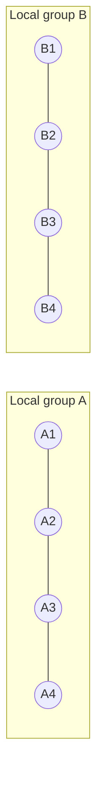
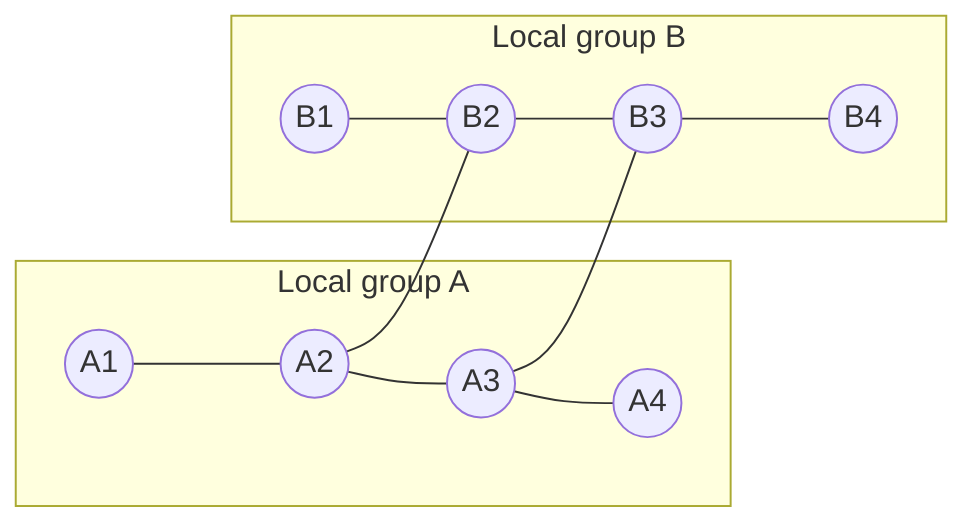
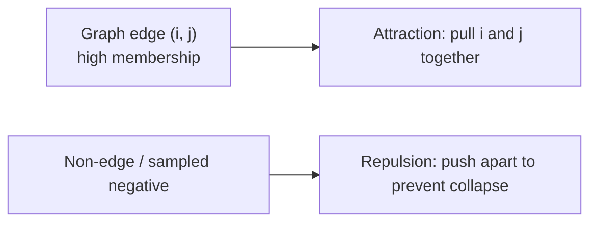
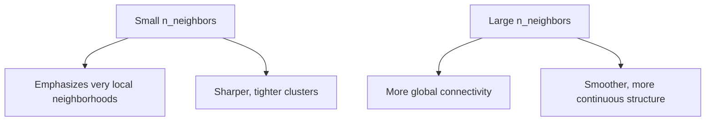
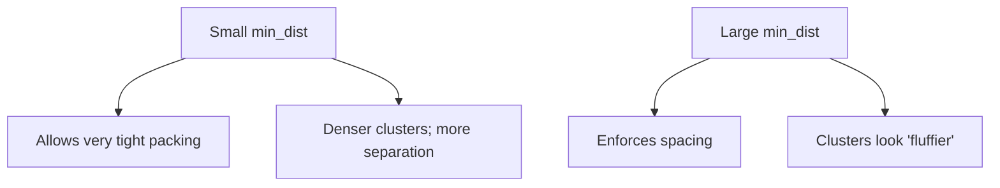
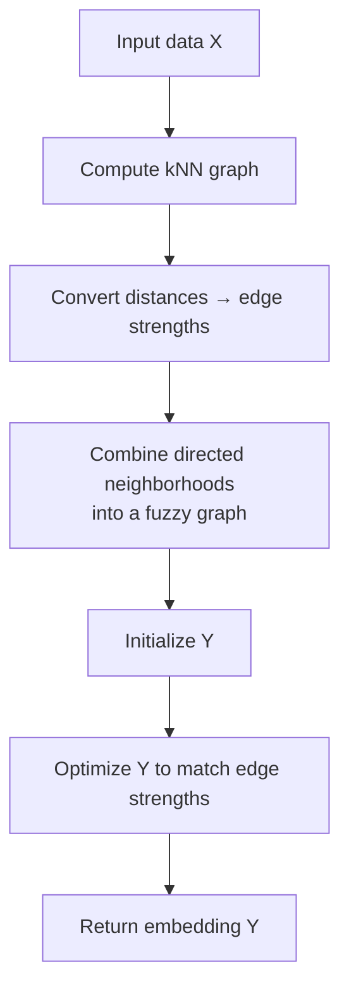

# UMAP (Uniform Manifold Approximation and Projection)

UMAP is a nonlinear dimensionality reduction algorithm that builds a **weighted neighbor graph** in high dimensions and then learns a low-dimensional embedding that best preserves that graph.

If you want the full mathematical deep dive, see: [How UMAP Works](../how_umap_works.md).

## Squeeze Implementations

Squeeze provides two UMAP implementations:

- `squeeze.UMAP` (Python): full-feature UMAP API (UMAP-learn compatible).
- `squeeze.RustUMAP` (Rust): a minimal Rust backend focusing on the core pipeline (dense + exact kNN + fuzzy graph + SGD). It currently exposes `fit_transform()` only.

## Quick Start

```python
import squeeze
from sklearn.datasets import load_digits

digits = load_digits()
X = digits.data

# Full-feature Python UMAP
umap = squeeze.UMAP(n_components=2, n_neighbors=15, min_dist=0.1, random_state=42)
X_umap = umap.fit_transform(X)

# Minimal Rust UMAP (if available)
if squeeze.RustUMAP is not None:
    umap_rust = squeeze.RustUMAP(n_components=2, n_neighbors=15, n_epochs=200, random_state=42)
    X_umap_rust = umap_rust.fit_transform(X)
```

## What UMAP is “trying to keep the same”

UMAP is easiest to interpret as preserving **neighbor relationships** (local structure), while still producing a globally coherent layout because neighborhoods must connect consistently.


## Phase 1: Build a fuzzy neighbor graph

UMAP starts with a k-nearest-neighbor graph and converts distances into **edge strengths** (think: “how confident are we that i and j are neighbors?”).

### Visual intuition: the same points, two different neighborhood scales

Small `n_neighbors` builds a *more local* graph; large `n_neighbors` builds a *more connected* graph.

#### Small `n_neighbors` (mostly within local groups)



#### Large `n_neighbors` (adds more cross-group connectivity)



## Phase 2: Lay out the graph in low dimensions

UMAP then learns positions \(y_i\) so that:

- edges with **high** membership strength become **short distances** (attraction),
- non-edges are kept apart (repulsion, often implemented with negative sampling).

### Visual intuition: attraction vs repulsion



## The two knobs you feel the most

### `n_neighbors` (local scale)



### `min_dist` (how tightly points can pack)



## Step-by-step summary



## Parameters

### `squeeze.UMAP` (Python)

UMAP-learn exposes many parameters; these are the ones that most often matter:

- `n_components` (int, default=2): output dimensionality
- `n_neighbors` (int, default=15): neighborhood size (local vs global tradeoff)
- `min_dist` (float, default=0.1): minimum spacing in the embedding (cluster tightness)
- `metric` (str/callable, default="euclidean"): distance function in the input space
- `random_state` (int/None): set for reproducible results

### `squeeze.RustUMAP` (Rust)

The Rust implementation currently focuses on the core UMAP pipeline, with this constructor:

- `n_components` (int, default=2): output dimensionality
- `n_neighbors` (int, default=15): k for kNN graph construction
- `n_epochs` (int, default=200): SGD epochs
- `min_dist` (float, default=0.1): controls how tightly points can pack
- `spread` (float, default=1.0): controls the scale at which embedded points are spread out
- `learning_rate` (float, default=1.0): SGD step size
- `negative_sample_rate` (int, default=5): number of negative samples per positive edge
- `gamma` (float, default=1.0): repulsion strength
- `random_state` (int/None): set for reproducibility

> **Note**: `squeeze.RustUMAP` currently uses **exact kNN** (O(n²)) and supports **dense inputs only**.

## How to interpret UMAP plots safely

- **Local neighborhoods are meaningful**: if points are close, they were likely neighbors in high-D.
- **Global distances are somewhat meaningful**, but still not a strict metric—don’t over-interpret exact between-cluster spacing.

## Tips

1. Start with defaults (`n_neighbors=15`, `min_dist=0.1`) and only tune if needed.
2. Standardize features when scales differ significantly.
3. If you mainly want clusters, try smaller `min_dist` and smaller-to-medium `n_neighbors`.
4. If you care more about broad structure, increase `n_neighbors`.

## Citation

```bibtex
@article{mcinnes2018umap,
  title={UMAP: Uniform Manifold Approximation and Projection for Dimension Reduction},
  author={McInnes, Leland and Healy, John and Melville, James},
  journal={arXiv preprint arXiv:1802.03426},
  year={2018}
}
```
